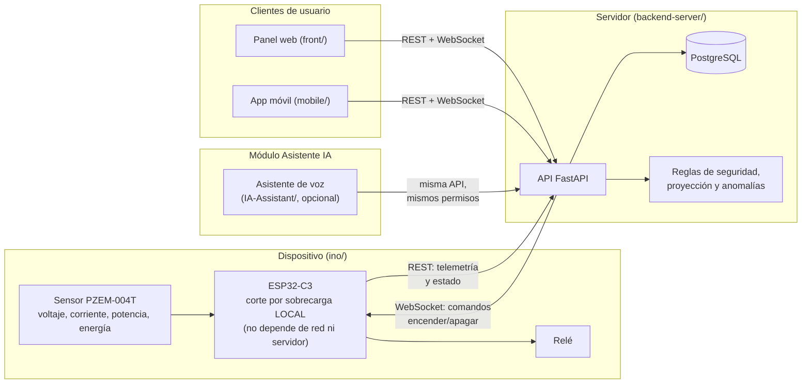

# VoltGuard

Plataforma IoT de monitoreo, control y protección eléctrica ("breaker inteligente"): un
dispositivo físico (ESP32-C3 + sensor PZEM-004T + relé) mide el consumo de una carga eléctrica en
tiempo real y puede cortarla automáticamente ante una condición de riesgo, de forma autónoma y sin
depender de la red. Un backend central administra usuarios, sitios y dispositivos, expuesto a un
dashboard web y a una aplicación móvil Android.

## Estructura del monorepo

```
.
├── backend-server/   API FastAPI + PostgreSQL + Alembic (Python 3.12)
├── front/            Dashboard web — usuarios y administración (React + Vite + TypeScript)
├── mobile/           App Android de usuario final (React + Capacitor + TypeScript)
├── ino/              Firmware ESP32-C3 (no modificar pines/lógica eléctrica ya validada)
├── IA-Assistant/     Asistente de voz, módulo opcional y desacoplable
├── infra/            Proxy inverso y TLS para el despliegue completo (Caddy)
└── docs/             Documentación de referencia
```

Cada carpeta es independiente, con sus propias dependencias. El único contrato compartido entre
clientes (`front/`, `mobile/`, `ino/`) es la API HTTP/WebSocket que expone `backend-server/`.

## Arquitectura



El dispositivo nunca le habla directamente a un cliente, ni un cliente al dispositivo: todo pasa
por el servidor, que es el único punto que conoce el estado completo del sistema. El corte crítico
por sobrecarga ocurre localmente en el propio microcontrolador, como respaldo autónomo aunque el
servidor no esté disponible; el servidor agrega una segunda capa de reglas de seguridad, además de
la proyección de gasto y la detección de anomalías. El asistente de voz es un módulo aparte que
reutiliza la misma API y los mismos permisos que ya usan el panel web y la app móvil.

## Desarrollo local

Backend (con recarga de bind-mount, sin proxy ni TLS):

```
cd backend-server
docker compose up -d
docker compose exec api alembic upgrade head
```

Dashboard web y app móvil (cada uno en su propio puerto de Vite, apuntando a `localhost:8000`):

```
cd front && npm install && npm run dev
cd mobile && npm install && npm run dev
```

## Despliegue completo

El `docker-compose.yml` de la raíz levanta la base de datos, el backend y un proxy Caddy con TLS
local, sirviendo el build de `front/` bajo el mismo origen que la API. Sin dependencia de ningún
registro de imágenes: cada máquina construye las suyas con `docker compose build`.

```
cp .env.example .env   # completar variables
docker compose up -d --build
```

Más detalle en [`docs/despliegue.md`](docs/despliegue.md).

## Documentación

- [`docs/despliegue.md`](docs/despliegue.md) — despliegue de la plataforma completa.
- [`docs/BASE-REPO-README.md`](docs/BASE-REPO-README.md) — README del repositorio base del que
  partió el firmware, conservado como referencia histórica.
