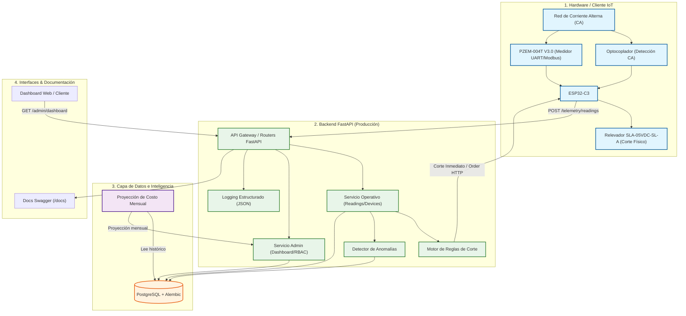

# ⚡ VoltGuard — Smart Breaker & Telemetría de Energía IoT


> **Plataforma IoT de Monitoreo de Energía, Detección de Anomalías e Interrupción Inteligente de Corriente.**

---

## Visión General del Producto

**VoltGuard** es un sistema de telemetría e interrupción inteligente de energía (Smart Breaker) diseñado para entornos domésticos, laboratorios e industrias pequeñas. El sistema ingiere lecturas eléctricas en tiempo real desde microcontroladores (ESP32/Arduino), evalúa sobrecargas mediante un motor de reglas en el backend e interrumpe automáticamente la corriente ante condiciones críticas para proteger los equipos.

Para atender las necesidades de operación y gestión, el sistema cuenta con dos contextos principales:
* **API Operativa (Usuario Final / IoT Edge):** Ingesta continua de telemetría (`POST /telemetry/readings`), control manual/automático del relé, alertas individuales y cálculo de costo proyectado.
* **API de Administración (Dashboard & Grupos):** Dashboard de agregaciones globales (`GET /admin/dashboard/metrics`), CRUD de usuarios con control de acceso por roles (RBAC) y gestión de dispositivos agrupados (ej. por edificio o laboratorio).

### Inteligencia integrada

VoltGuard incorpora tres piezas de inteligencia sobre la telemetría ingerida:

1. **Motor de reglas de corte** — evalúa cada lectura contra umbrales configurados y dispara el evento `CRITICAL_OVERLOAD`, ordenando el apagado remoto en <500ms desde la detección.
2. **Detector de anomalías** — identifica comportamiento de consumo atípico por aparato/dispositivo, comparándolo contra su propio histórico.
3. **Proyección de costo** — estima la tendencia de consumo y el costo mensual acumulado con un margen de error objetivo <10%.

---

## Enlaces del Proyecto (Producción & Demostración)

* **URL de Producción (API REST):** `PENDIENTE_DESPLIEGUE` *(Próximamente)*
* **Documentación Interactiva (Swagger UI):** `PENDIENTE_DESPLIEGUE/docs`
* **Health Check Endpoint:** `PENDIENTE_DESPLIEGUE/health`
* **Video Demo (Presentación):** `PENDIENTE_VIDEO_DEMO`

---

## Arquitectura del Sistema



---

## Stack Tecnológico
* **Backend Framework:** FastAPI (Python 3.12)
* **Base de Datos & ORM:** PostgreSQL + SQLAlchemy 2.x + Alembic (Migraciones)
* **Inferencia & ML:** Scikit-learn (Proyección de consumo y costos, detección de anomalías)
* **Calidad de Código:** Pytest (100% coverage), Ruff (Linter), Mypy (Tipado estricto)
* **Orquestación & CI/CD:** Docker, Docker Compose, GitHub Actions
* **Seguridad:** JWT + RBAC, `SECRET_KEY` gestionado por variable de entorno (nunca en el código)

---

## Puesta en marcha local

### Requisitos previos
* Docker y Docker Compose
* Python 3.12 (si se quiere correr fuera de contenedores)

### Con Docker Compose (recomendado)
```bash
git clone https://github.com/SNPAIX/Smart-Breaker-Telemetria-de-Energia-IoT.git
cd Smart-Breaker-Telemetria-de-Energia-IoT/voltguard-backend
cp .env.example .env   # completar variables (ver sección siguiente)
docker compose up --build
```
La API queda disponible en `http://localhost:8000` y la documentación interactiva en `http://localhost:8000/docs`.

### Entorno local (sin Docker)
```bash
cd voltguard-backend
python3 -m venv .venv
source .venv/bin/activate
pip install -r requirements.txt
export $(grep -v '^#' .env | xargs)
alembic upgrade head
uvicorn app.main:app --reload
```

### Correr pruebas y linters
```bash
python3 -m ruff check .
python3 -m mypy app/
python3 -m pytest -q --cov=app --cov-report=term-missing
```

---

## Variables de entorno

| Variable | Descripción |
|---|---|
| `DATABASE_URL` | Cadena de conexión a PostgreSQL |
| `SECRET_KEY` | Clave de firma JWT (obligatoria, sin valor por defecto inseguro en producción) |
| `ACCESS_TOKEN_EXPIRE_MINUTES` | Vigencia del token de acceso |
| `ENVIRONMENT` | `development` / `production`, controla nivel de logging y validaciones |

---

## Endpoints principales

### API Operativa
| Método | Ruta | Descripción |
|---|---|---|
| `POST` | `/telemetry/readings` | Ingesta de una lectura de telemetría |
| `GET` | `/devices` | Lista los dispositivos del usuario |
| `POST` | `/devices/{id}/switch` | Corte manual/automático del relé |
| `GET` | `/devices/{id}/cost-projection` | Proyección de costo mensual del dispositivo |

### API de Administración
| Método | Ruta | Descripción |
|---|---|---|
| `GET` | `/admin/dashboard/metrics` | Métricas agregadas globales |
| `CRUD` | `/admin/users` | Gestión de usuarios (RBAC) |
| `CRUD` | `/admin/device-groups` | Gestión de grupos de dispositivos |

### General
| Método | Ruta | Descripción |
|---|---|---|
| `GET` | `/health` | Health check |

---

## Equipo de Desarrollo
* **Integrante 1 (Embedded & IoT Edge):** Firmware en microcontrolador, integración de sensores/relé e ingesta de telemetría.
* **Integrante 2 (Backend & Database Architecture):** Modelado de entidades (SQLAlchemy), RBAC, seguridad JWT y API Admin.
* **Integrante 3 (IA, Dashboard & DevOps):** Algoritmo de predicción de costo, agregaciones de dashboard, Docker y pipeline CI/CD.